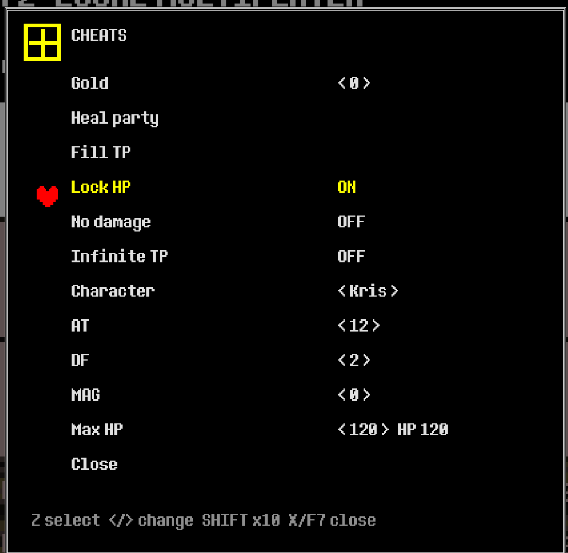

# DELTARUNE mod loader + reverse-engineering notes

Tools for modding the Steam release of **DELTARUNE** (GameMaker VM runner, x64, Windows).

| Folder | What |
|---|---|
| [`mods_examples/`](mods_examples/) | Example mods: `CheatMenu` (F7 in-game cheat overlay; new object/sprite/sound + patch files), `SpriteInspector` (F9 labels every sprite on screen with its name) |
| [`modloader/`](modloader/README.md) | `version.dll` proxy mod loader. It handles loose-file overrides, **loose `.gml` script replacement** (no xdelta, and `data.win` is never modified), script redirects, and loads Aurie + YYToolkit (patched for DELTARUNE). |
| [`modloader/yytk_plugin/`](modloader/yytk_plugin) | Example YYToolkit v5 plugin that reads the room and globals live. |
| [`modloader/tools/`](modloader/tools) | `ImportLooseMod.csx` (loose GML/patch/sprite/sound import), `export_sprites.bat` (copy original sprite frames into a mod), `xdelta_to_gml.py` (xdelta mod → loose GML) and `gml_to_patches.py` (full `.gml` → `.diff` patches). |
| [`external/YYToolkit`](https://github.com/jfmherokiller/YYToolkit/tree/fix/vm-room-data-non-inlined) | Submodule: our YYToolkit fork, which contains the fix submitted upstream as [AurieFramework/YYToolkit#85](https://github.com/AurieFramework/YYToolkit/pull/85). |
| [`RE/`](RE/00_README.md) | Reverse-engineering notes for `DELTARUNE.exe` (VM, `data.win` loader, instances, globals) and the Cheat Engine / PINCE stat trainers. |

## Example: CheatMenu

[`mods_examples/CheatMenu`](mods_examples/CheatMenu) puts the Cheat Engine table inside the game.
Press **F7** anywhere to freeze the game and open it. It's built only from loose files: a new object,
sprite and sound, plus two small patches, so it stacks with other mods.

## Install (players)

1. Download the release zip and extract it into the DELTARUNE folder, next to `DELTARUNE.exe`.
2. For loose-GML mods, also extract [UndertaleModTool CLI 0.9.2.0](https://github.com/UnderminersTeam/UndertaleModTool/releases/tag/0.9.2.0)
   (`UTMT_CLI_v0.9.2.0-Windows.zip`) into `mods\tools\utmt\`.
3. Put each mod in `mods\<ModName>\`. See [`modloader/README.md`](modloader/README.md) for the layout.

To uninstall, delete `version.dll`.

## Build

- **Loader:** `modloader\build.bat` (VS 2022, x64 Native Tools not required; it calls `vcvars64.bat`).
- **YYToolkit:** `git submodule update --init`, then
  `MSBuild external\YYToolkit\YYToolkit\YYToolkit.vcxproj -p:Configuration=Release -p:Platform=x64`.
- **Example plugin:** `modloader\yytk_plugin\build.bat`.

## Not included

- Game files, or decompiled game code (`RE/code/` stays local; you can regenerate it with UTMT).
- Third-party mods. Convert your own copy of an xdelta mod with `tools/xdelta_to_gml.py`.

## Licenses

The loader and docs are MIT ([LICENSE](LICENSE)). Vendored MinHook is BSD-2 (`modloader/third_party/minhook/LICENSE.txt`).
YYToolkit / Aurie are AGPL-3.0 and are used unmodified apart from the fork's patch; their headers are in `modloader/yytk_plugin/include`.
DELTARUNE is © Toby Fox. This project is not affiliated with Toby Fox.
