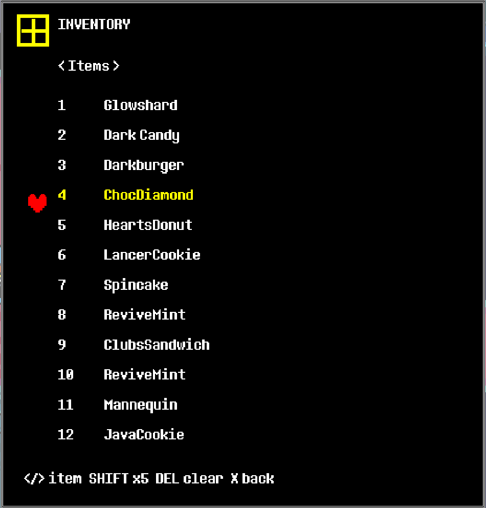

# CheatMenu (example mod)

An in-game version of the Cheat Engine table. Press **F7** anywhere, in the overworld or in battle. The game
freezes and a cheat overlay opens.

| Row | Keys |
|---|---|
| Gold | ←/→ ±10 (Shift ±1000) |
| Heal party / Fill TP | Z |
| Lock HP / No damage / Infinite TP | Z or ←/→ toggles; stays active after closing |
| Character | ←/→ picks the party member for the stat rows |
| AT / DF / MAG / Max HP | ←/→ ±1 (Max HP ±10; Shift ×10) |
| Inventory... | Z opens the inventory editor (below) |
| Enemies... | Z opens the enemy editor (below) |
| Close | Z, X or F7 |

### Enemy editor (battles)

Open F7 during a battle, then **Enemies...**:

| Row | Effect |
|---|---|
| Auto mercy | keeps every enemy at full mercy and Tired, so SPARE / Pacify always work (stays on after closing) |
| All: can spare | full mercy + Tired for every enemy, once |
| All: HP 1 | every enemy to 1 HP |
| per enemy: HP / Mercy / Tired | ←/→ ±10 (Shift ±100); Z toggles Tired |

Scripted story and boss fights (Chapter 2's Queen, Spamton NEO, Jevil, King...) are started
with `global.specialbattle` set, and forcing their spare state crashes or breaks their scripted
endings (seen sparing Queen). In those fights the mercy rows are hidden, auto mercy pauses and
"All: can spare" refuses. HP editing still works there.

### Inventory editor

Edits the Dark World inventory: **Items** (12 slots), **Weapons** and **Armor** (48 slots; 12 in
Chapter 1), and **Key Items** (12).

| Keys | Effect |
|---|---|
| ←/→ on the top row | switch category |
| ↑/↓ | pick a slot (the list scrolls) |
| ←/→ on a slot | cycle through every item the chapter has (Shift ×5) |
| Del / Backspace / C | empty the slot |
| X | back to the cheat page |

Item names come from the game's own `scr_iteminfo` / `scr_weaponinfo` / `scr_armorinfo` /
`scr_keyiteminfo`, so the list matches each chapter (and other mods' added items) automatically.
The game's menus stop at the first empty slot, so gaps are closed when you leave the page.
Equipped gear (`global.charweapon` / `chararmor`) and the Light World inventory aren't edited.

Install: copy `CheatMenu\` into `DELTARUNE\mods\`. It needs the loader plus `mods\tools\` (the UTMT CLI and
`ImportLooseMod.csx`).

## What it shows off

Everything is in `all_chapters\`, which is applied to every `chapterN_windows\data.win`:

- `code\gml_Object_obj_drcheat_*.gml`: a **new object**, created from nothing by naming its event code.
- `code\gml_Object_obj_time_Step_1.append.gml`: an **append patch**. It adds code to the end of the
  persistent `obj_time` step event without replacing it, so it stacks with other mods (tested
  together with LocalMultiplayer, which replaces that same script).
- `code\gml_Object_obj_time_Draw_64.patch`: a **find/replace patch** that shows "press F7" for about 5 s.
- `sprites\spr_drcheat_icon_0.png` + `.origin.txt`: a **new sprite**.
- `sounds\snd_drcheat_open.ogg`: a **new sound**, played through `snd_play(snd_drcheat_open)`.

"No damage" holds `global.inv` (the invulnerability timer), the same trick as the CE table, so
scripted hazards that bypass it still hit.
