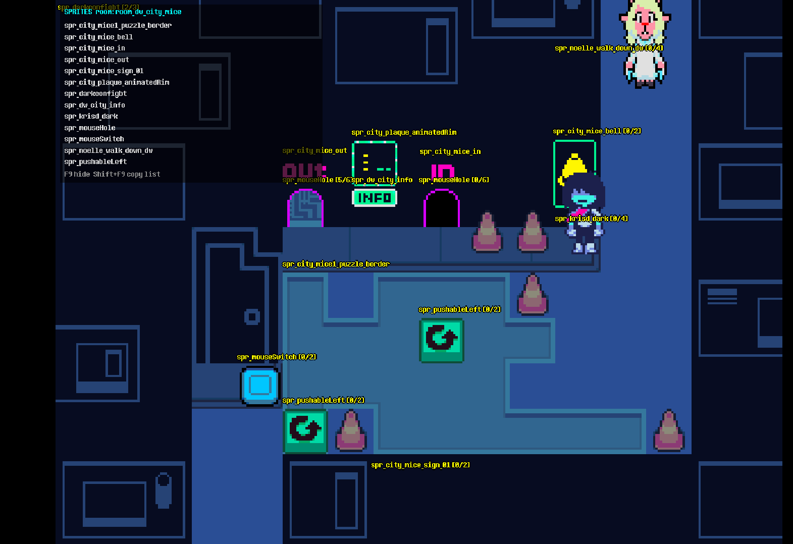

# SpriteInspector (modding tool)

Press **F9** in any chapter to label every sprite on screen with its name and frame
(`spr_krisd_dark [0/4]`), plus a panel listing the room and every unique sprite name.
Sprites placed directly on room layers (decorations) are labeled too.
**Shift+F9** copies the list to the clipboard.

Use the names with `mods\tools\export_sprites.bat` (see `modloader/README.md`, "Replacing a sprite").

Built only from loose files: a new object `obj_drspriteinfo`, plus a 3-line
`obj_time_Step_1.append.gml` that keeps one alive in every room. F9 is only a debug key in the
game's own battle code, which is inactive in retail builds.
